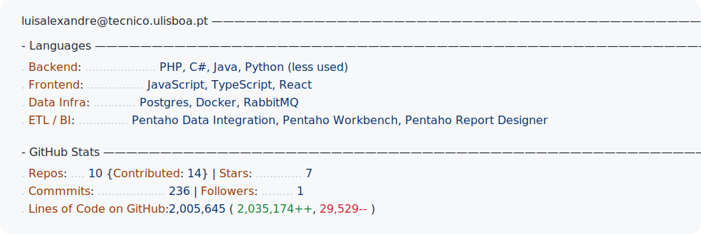

  

  <strong>Full-stack problem solver • MSc Computer Science @Instituto Superior Técnico (in progress)</strong> 
  Lifelong learner focused on turning curiosity into human-centered utilitys.

  
  
  
  

## About Me

- Master’s in Computer Science (started in 2025) at Instituto Superior Técnico, built on a Bachelor’s degree in Computer Science from Universidade do Algarve (grade: 15/20).
- From hands-on technician to research-driven engineer: pragmatic about tools, obsessed with systems that impact real people.
- Balanced experience across backend/frontend, data, distributed systems, AI experiments and user-oriented product design.
- Comfortable in multidisciplinary teams, happy to mentor, and have a high tolerance for hairy problems.
- Currently looking for an internship or entry-level role where I can apply these fundamentals and keep learning.

## Right Now

- Pursuing the MSc at Instituto Superior Técnico with a specialization in Artificial Intelligence and Data Science
- Completed **Data Integration** and **Forensics & Cyber-Security**
- Currently taking **Data Science** and **Foundations of Information Systems**
- Always experimenting with new ways to present personal metrics and insights on GitHub Pages

---

## Tech Playground

  <picture>
    <source media="(prefers-color-scheme: dark)" srcset="dark_mode.svg">
    <source media="(prefers-color-scheme: light)" srcset="light_mode.svg">
    
  </picture>

## Education & Experience

> **Instituto Superior Técnico** (2025 → ...) · MSc in Computer Engineering  
> Focus: Data Science and Artificial Intelligence.  
> [Syllabus](https://fenix.tecnico.ulisboa.pt/cursos/meic-t/curriculo)

> **Universidade do Algarve** (2021 → 2025) · BSc in Computer Science · Nota final: 15/20  
> Strong foundation in maths, phisics, algorithms, databases, networking, and full-stack development  
> [Syllabus](https://www.ualg.pt/curso/1478)

> **Software & Web Developer Trainee @ DigitSigma** (Loulé, Portugal)
> Built web apps and Windows Forms (.NET) solutions that tied together databases, APIs, and responsive interfaces. Worked with C#, PHP, JavaScript, HTML/CSS, Bootstrap, Axios/Ajax, and focused on shipping features that solved tangible problems. Paused the internship to pursue the BSc in Computer Science.

---

## Highlighted Projects

  
  

  
  

  

**Quick Highlights**

- **Distributed Key-Value Storage System** · Resilient architecture with FastAPI, Redis, RabbitMQ, CockroachDB, observability, and autoscaling  
- **Coinky Mealheiro Digital** · Hybrid web + Arduino solution that makes daily finance management tactile and intuitive  
- **Web API Integration App** · Movie discovery with TMDB API, full auth flow, and a React + Material UI interface  
- **Digit Recognition NN V2** · Improved handwritten digit classifier with better regularization, plotting, and evaluation tooling   
- **SnakeOOPS** · Modular snake game using Singleton, Abstract Factory, and Strategy patterns with GUI and CLI modes

---

## Stats & Vibes

  

  

---

## Let's Talk

- **Open to internships and collaborations** · feel free to DM via GitHub or LinkedIn
- Love turning ideas into products and always excited to jam on distributed systems, applied AI, or UI/UX for devs
- If you're also into building by learning out loud, let's chat

