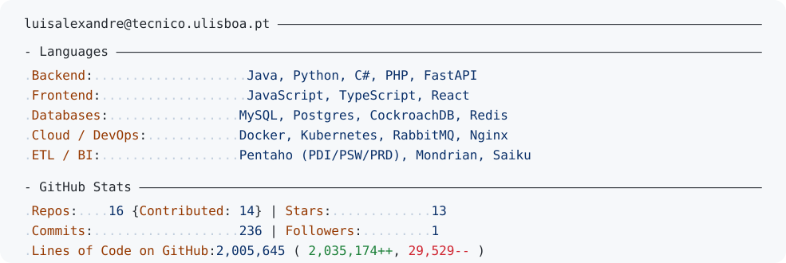

  

  <strong>Full-stack problem solver • MSc Computer Science @Instituto Superior Técnico (in progress)</strong> 
  Lifelong learner focused on turning curiosity into human-centered utilitys.

     

## About Me

- Master’s in Computer Science (started in 2025) at Instituto Superior Técnico, built on a Bachelor’s degree in Computer Science from Universidade do Algarve (grade: 15/20).
- From hands-on technician to research-driven engineer: pragmatic about tools, obsessed with systems that impact real people.
- Balanced experience across backend/frontend, data, distributed systems, AI experiments and user-oriented product design.
- Comfortable in multidisciplinary teams, happy to mentor, and have a high tolerance for hairy problems.

## Right Now

- Pursuing the MSc at Instituto Superior Técnico with a specialization in Artificial Intelligence and Data Science
- Completed **Advanced Programming**, **High-Reliability Systems**, **Data Science**, **Data Analysis and Integration**, and **Cybersecurity Forensics**
- Currently taking **Autonomous Agents and Multi-Agent Systems** and **Cloud Computing and Virtualization**
- Always experimenting with new ways to present personal metrics and insights on GitHub Pages

---

## Tech Playground

  <picture>
    <source media="(prefers-color-scheme: dark)" srcset="dark_mode.svg">
    <source media="(prefers-color-scheme: light)" srcset="light_mode.svg">
    
  </picture>

## Education & Experience

> **Instituto Superior Técnico** (2025 → ...) · MSc in Computer Engineering  
> Focus: Data Science and Artificial Intelligence.  
> [Syllabus](https://fenix.tecnico.ulisboa.pt/cursos/meic-t/curriculo)

> **Universidade do Algarve** (2021 → 2025) · BSc in Computer Science · Nota final: 15/20  
> Strong foundation in maths, phisics, algorithms, databases, networking, and full-stack development  
> [Syllabus](https://www.ualg.pt/curso/1478)

> **Software & Web Developer Trainee @ DigitSigma** (Loulé, Portugal)
> Built web apps and Windows Forms (.NET) solutions that tied together databases, APIs, and responsive interfaces. Worked with C#, PHP, JavaScript, HTML/CSS, Bootstrap, Axios/Ajax, and focused on shipping features that solved tangible problems. Paused the internship to pursue the BSc in Computer Science.

---

## Highlighted Projects

<table align="center" width="100%">
  <tr>
    <td align="center" width="50%">
      
    </td>
    <td align="center" width="50%">
      
    </td>
  </tr>
  <tr>
    <td align="center">
      
    </td>
    <td align="center">
      
    </td>
  </tr>
  <tr>
    <td align="center">
      
    </td>
    <td align="center">
      
    </td>
  </tr>
  <tr>
    <td align="center" colspan="2">
      
    </td>
  </tr>
</table>

**Quick Highlights**

- **ETL & OLAP Data Warehouse Pipeline** · End-to-end data warehousing solution with ETL processes and OLAP analytics for multidimensional analysis
- **Permissioned Blockchain with BFT Consensus** · DepChain: permissioned blockchain with HotStuff BFT consensus, EVM smart contracts, and frontrunning-resistant ERC-20 approvals
- **ML Prediction Pipeline** · End-to-end machine learning pipeline with multiple classifiers and a FastAPI interface for real-time predictions and batch evaluation
- **Digit Recognition NN V2** · End-to-end MNIST digit recognizer with a from-scratch Java neural network and a web playground for live inference
- **Distributed Key-Value Storage System** · Resilient architecture with FastAPI, Redis, RabbitMQ, CockroachDB, observability, and autoscaling
- **React + TS REST API Movie App** · Full-stack movies and TV shows app with React, TypeScript, and a Node.js REST API, powered by the TMDb API
- **2D Physics Engine** · Web-based 2D physics simulation built from scratch with p5.js, featuring rigid body dynamics, AABB collisions, and Verlet integration
